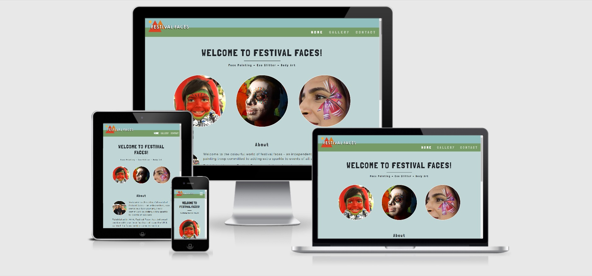
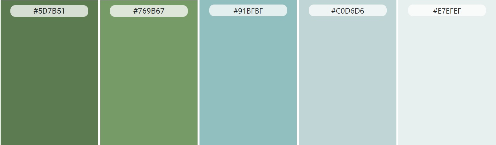

# Festival-Faces
[Click here to see live website](https://richardthorp.github.io/Festival-Faces/index.html)

This is a website for the face painting company 'Festival Faces'. The company provide face painting, eco glitter and body art services at children's parties, corporate events,
festivals and many other events. 
The primary users of the website are parents and carers, business owners and event organisers.

The business goals of the website are:
* Increase bookings
* Provide a central place to direct business leads via online or in person marketing
* Reassure potential customers of quality and legitimacy through a well made website with great UX 

## Table of Contents

[User Experience - UX](#UX)

[Design](#design)

[Features](#features)

[Languages and Technologies](#tech)

[Testing](#testing)

[Deployment](#deployment)

[Credits](#credits)

## UX
### User Profiles
* I am an event organiser looking for fun activities to offer guests.
* I am an event organiser looking for businesses to sell a pitch at a festival or fair to.
* I am a parent or carer looking to book suitable entertainment for a child's party.
* I am a business owner looking to add something different to a staff party or PR event. 

### User Stories
As a first time user of this website, I want to:
* Immediately understand how to navigate the website.
* Understand the purpose of the website.
* See examples of previous work.
* Understand what services are offered.
* Gain an understanding of costs.
* Gain an undertanding of the company to attain whether they are right for my needs. 
* Find links to social network channels to find reviews and updates.
* Quickly find contact details.

As a returning user of this website, I want to:
* Quickly find contact details.
* Check for updated examples of work.
* Check for updated costs.

## Design

### Wireframes
[Click here to view Home page wireframes](assets/images/readme-images/homepage-wireframes.png)

[Click here to view Gallery page wireframes](assets/images/readme-images/gallery-wireframes.png)

[Click here to view Contact page wireframes](assets/images/readme-images/contact-wireframes.png)

### Colour Scheme

The colours found throughout the website are all shades of the colours [found in the company logo](assets/images/readme-images/ff-logo.jpg). The original design for the website featured a navigation bar with the same green (#769B67) found in the logo, however this proved to be too light a backgound colour to have sufficient contrast whilst using shades of white for the links. I felt that the off white and white shades worked well in the navigation bar, and therefore opted to change the background colour instead. 

The main body of the website is a lighter shade (#C0D6D6) of the blue found in the logo and navigation bar. The outcomes of using the lighter shade chosen are:
* Clearer contrast between the background colour and font colour.
* More contrast between the images and background colour.
* A light and non oppressive user experience when compared to a heavy, darker colour.

An even lighter shade (#E7EFEF) of the logo blue can be found in the 'Services' area of the home page, as well as in the Gallery page and the Contact page. This was used in the Gallery page to further accentuate the contrast between images and the background colour. The lighter shade was used in the 'Services' section and on the Contact page to break up the content and to draw the eye of the user to the key information on the page. 

The 'Send' button at the bottom of the contact form is the same blue (#91BFBF) from the logo, ensuring the element is consistent with the rest of the website.

### Fonts
The font used for all of the headings throughout the website is 'Londrina Solid' from Google Fonts. This font was used in part as it is similar in style to the font found on the company logo. It works well for the website and therefore the business, as it connotes feelings of fun and of being hand made. As a back-up font, 'Impact' has been chosen as it is a very 'web-safe' font, as well as being striking and stencil like, which is appropriate for a website pertaining to art. The company logo font was not chosen for headings as the shadow effect detracted from the clarity of the headers.

The font used for all other text on the website is 'Raleway' from Google Fonts. This font was chosen as it is very legible, even at small font sizes as well as being generally pleasing to the eye. As a back up font, 'Arial' has been selected as it is very 'web-safe' and is also very clear and easily legible.

### Features
#### Implemented Features
Each page features a responsive navigation bar with the navigational links clearly listed to the right of the page, or being found in a dropdown list by clicking a 'hamburger' button which appears on screens 575 pixels wide or less. The page the user is currently on is made clear by the navigational link for that page being brighter than the other links in the navigation bar. The logo on the left of the navigation bar also serves as a link to the home page - a feature which is widely used in web design and therefore expected by the user. 

Each page also features the same footer which contains a link to the business' email address, links to the business' social network pages and the copyright infomation for the website. All clickable links are clearly indicated with a subtle change in colour when the curser is hovered over them. The footer also implements responsive design by reordering the footer content to push the copyright information to the bottom of the screen and the more important social network and email links above on small screen sizes.

##### Home
The home page features a short welcome message to the user, followed by a tag line which quickly tells the user the purpose of the business. Immediately below are 3 circular images on screen sizes 768 pixels wide and above, or 1 circular image on smaller screen sizes. The purpose of the 3 images on larger screens is to immediately display a selection of examples of work to the user. On smaller screens where only 1 image is displayed, the image acts as a more standard hero image, giving the user an immediate and stricking example of what the website is about.

Beneath this, the user finds the 'About' section, comprised of a small picture of some of the Festival Faces team along with 3 short sentences that summarise the ethos of the business, provide examples of previous clients and offer a link to 'get in touch'. The picture, with the three women all smiling establishes a human connection between business and the user, as well as providing reasurrance that this business is operated by friendly and happy people. The copy contained in the 'About' section is kept short and to the point so as not to overwhelm the user with information, and provide a call to action in the form of the 'get in touch' link which is clearly styled as a clickable link.

The third and final section of the page goes on to highlight very briefly the most common types of events for which the business is booked regularly. This serves as to further reassure the user that 'Festival Faces' is a suitable company to hire for their event. This section also where possible, clearly provides prices for hiring the business and where prices can't be immediately given, another link and invitation to 'get in touch' is provided.

##### Gallery
The gallery page is virtually kept entirely free of text, except to explain to the user that they can 'Click on image to enlarge'. The gallery features an even number of thumbnails horzontally centered, thus ensuring the page is always symmetrical and visually pleasing. The images offer a wide selection of examples of previous work, including face painting, eco glitter and body art. The images also display clientelle of all age groups and genders, so as to reassure the user that this business is approprate for as wide a target market as possible. 
When clicked, the thumbnails open a modal which enlarges the image making it much easier for the user to see. Whist a 'Close' button is offered, the user can click anywhere outside of the modal to close it. This is a commonly used feature throughout web design and therefore expected by the user and good UX.

##### Contact
The contact page is kept very simple, with an invitation to email the business or if prefered use the contact form to send an enquiry. The contact form uses form validation to ensure appropriate responses have been entered, such as the use of an @ charactor in the email address field. On screens 768 pixels or wider, and attractive image of a facepainter testing paint on her arm whilst surrounded by paints and brushes is displayed. This is a nice way to fill the space and further reinforce the authentic and creative nature of the business.

#### Potential Future Features
* A hero video in place of the three images found on the home page. This would be an improved method of quickly establishing the business' purpose and ethos.
* An alternative to the modal code found in the Gallery page. Using Javascript, the code could be much more readable and maintainable.
* A thank you message in the form of a modal when the user sends an enquiry through the contact form. 
* A form that can give an immediate quote for potential customers by taking in variables such as location, number of guests and length of event and outputting an estimated price.

### Languages and Technologies  Used
The website has been built using HTML5 and CSS, as well as some Javascript via plugins as detailed below.

1. [Gitpod](https://www.gitpod.io/)
   * The IDE used to write the code for the website.
   
3. [Git](https://git-scm.com)
   * Used for version control during the website build via the command terminal in Gitpod
   
3. [GitHub](https://pages.github.com/)
   * Used to store the code after being 'commited' and 'pushed' using Git. 
   
3. [Bootstrap](https://www.getbootstrap.com/)
   * Used to create structure and some styling, as well as responsive aspects of the website.
   
4. [jQuery](https://www.jquery.com/)
   * Used to provide the Javascript found in the navigation bar.
   
5. [Google Fonts](https://www.fonts.google.com/)
   * Used to provide the 'Raleway' and 'Londrina Solid' fonts used throughout the website.
   
6. [Font Awesome](https://www.fontawesome.com/)
   * Used to provide the icons in the 'Services' section of the home page, as well as the social media icons in the footer.
   
7. [TinyJPG](https://www.tinyjpg.com/)
   * Used to compress image files used on the website to speed up loading times.
   
8. [Balsamiq](https://www.balsamiq.com/)
   * Software used to create wireframes.
   
9. [Autoprefixer](https://www.autoprefixer.github.io/)
   * Used to ensure cross browser validity for CSS.
   
10. [Am I Responsive?](http://ami.responsivedesign.is/)
    * Used to create mock-ups found at the top of this README.
   
11. [CSS Formatter](https://www.cleancss.com/css-beautify/)
    * Used to beautify CSS code.
   
12. [Beautify Tools](http://beautifytools.com/html-beautifier.php)
    * Used to beautify HTML code.
    
13. [CSSmatic](https://www.cssmatic.com/box-shadow)
    * Used to create box shadow effect.

### Testing
The HTML code has been checked against the [W3C Markup Validator](https://www.validator.w3.org/) and the CSS against the [W3C CSS Validator](https://www.validator.w3.org/) with any issues highlighted by the validators fixed. The code contains no validity issues.

#### Testing against user requirements (as listed in UX section)
As a first time user of this website, I want to:
* Immediately understand how to navigate the website.
  * The website follows common design features found throughout most websites. The navigation bar can be found at the top of every page, and clearly lists the areas of the website that the user can navigate to and what those areas are for.
  
* Understand the purpose of the website.
  * Upon arriving at the home page, the user is presented with a list of services offered ('FACE PAINTING - ECO GLITTER - BODY ART') by the business as well as examples of work in the form of the 3 images (1 on mobile). Directly below this is a short summation of what the business does in the 'About' section.

* See examples of previous work.
  * This requirement is met immediately upon arriving at the home page with the three images acting as a hero image (or 1 large image on mobile). This is further met by the gallery page which contains 18 images exhibiting a wide range of previous work.

* Understand what services are offered.
  The home page consists of very little in the way of copy, except for short consise paragraphs regarding the business' services and types of events catered for.

* Gain an understanding of costs.
  Prices for childrens parties are clearly detailed in the 'Services' section - seperate to the rest of the text and in bold. The other types of event listed in the services section are not possible to give prices for without further clarifications from the potential client. Where this is the case, a clear link to the 'Contact' page is offered.

* Gain an undertanding of the company to attain whether they are right for my needs. 
  * Again, the 'Home' page offers short and clear copy that summarises the business' ethos and services.

* Find links to social network channels to find reviews and updates.
  * As is common in web design, the footer contains links to the business' social network pages.

* Quickly find contact details.
  * The contact details are quickly found through the navigation bar link for 'Contact' as well as several links to the contact page throughout the copy on the 'Home' page. As well as this, the email address for the business can be found along with social network links in the footer.

As a returning user of this website, I want to:
* Quickly find contact details.
  * The contact details are quickly found through the navigation bar link for 'Contact' as well as several links to the contact page throughout the copy on the 'Home' page. As well as this, the email address for the business can be found along with social network links in the footer.

* Check for updated examples of work.
  * This is easily achieved by visiting the 'Gallery' page via the navigation bar.

* Check for updated costs.
  * Prices for childrens parties are clearly detailed in the 'Services' section - seperate to the rest of the text and in bold. The other types of event listed in the services section are not possible to give prices for without further clarifications from the potential client. Where this is the case, a clear link to the 'Contact' page is offered.

#### Manual testing of all elements thoughout the website
The tests detailed in this section were all completed using the following web browsers and hardware:
|                            | Chrome             | Edge             | Firefox            | Safari |
| -------------             |:------------------:| -----------------:|-------------------:|--------:|
| Microsoft Surface 3 (15") | :heavy_check_mark: |:heavy_check_mark: | :heavy_check_mark: | |
| Samsung Galaxy A6         | :heavy_check_mark: |:heavy_check_mark: | :heavy_check_mark:||
| Huawei P Smart 2019       | :heavy_check_mark: | :heavy_check_mark:| :heavy_check_mark: ||
| Macbook Pro 2016 (13")    | :heavy_check_mark: |                   | :heavy_check_mark: |:heavy_check_mark: |
| iPad 7th generation 2019  | :heavy_check_mark:  |                  | :heavy_check_mark: |:heavy_check_mark: |

#### Navigation Bar
* Looks and responds the same way on every page 

* Logo acts as link to index.html

* All links are functional

* Links change colour to white when curser hovers

* Link for current page displayed in white

* Links replaced with hamburger dropdown menu on screen sizes 575 pixels or less

* Navigation bar reduces in height on screen sizes 380 pixels or less

* All font and background colours colours pass contrast accessability tests on Google Dev Tools.

#### Footer
* Looks and responds the same way on every page 

* Links change colour to white when curser hovers

* All links are functional and open in a new window/tab

* All font and background colours colours pass contrast accessability tests on Google Dev Tools.

#### Home Page
* 3 images displayed unless viewed on device of screen size 767 pixels or below.

* Any copy containing 'get in touch' is clearly a link and links to contact page

* All sections maintain good readability and structure across all screen sizes

#### Gallery Page
* All thumbnails open correct expanded image

* Expanded images closed by clicking outside of the image or by clicking 'Close' 

* Image columns either 2, 4 or 6 thumbnails wide depending on width of screen size, and always presented symetrically

#### Contact page
* Image displayed on screen sizes 768 pixels wide and above

* All form inputs must to completed to send the form

* The email field must contain an '@' to send the form

### Additional Testing
* Friends and family asked to visit the website and report on any bugs or UX issues - no such issues have been found.
* Website posted to 'Peer Code Review' on the Code Institute Slack channel.

### Known Bugs
A modal which displayed a 'Thank you for your enquiry' message when the contact form is sent has been removed, as it displayed even when the form had not been correctly filled. This is a feature to be added at a later date when I have the technical ability to fix it.

There are no known bugs on the website.

### Deployment
###### Deployment to GitHub pages
The website was deployed to GitHub pages using the following process:

1. Log in to the GitHub website and select the 'Festival-Faces' repositary from the list in the top left of the screen.

2. Once viewing the repositary, click on 'Settings' which can be found in the navigation bar above the list of files and folders.

3. Scroll down to the 'GitHub Pages' section and under the 'Source' heading find the dropdown menu (default value is 'None'). Click on the dropdown menu and select 'master' from the list.

4. To the right of the dropdown menu, click the 'Save' button. The website is now deployed.

To find the link to the newly deployed site, follow these steps:

1. Navigate to the repositary's main screen (see step 1 of the deployment proccess).

2. To the right of the screen, click on the 'github-pages' under the 'Enviroments' heading.

3. Click on the 'View Deployment' button to the right of the screen. This will launch the website with the link which can now be used by anyone to view it.

###### Forking the Repositary
If you wish to work on this project within your own repositary, it can be forked using the following proccess:

1. Log in to your GitHub account on the GitHub website.

2. Using the search bar in the top left of the screen, search for 'richardthorp/Festival-Faces'.

3. Click on the search result and then click on the 'Fork' button to the right of the screen, above the list of files and folders.

4. The repositary is now 'forked' and saved in your own repositary.

###### Cloning the Repositary
If you wish to clone the repositary to work on locally, follow these steps:

1. Log in to GitHub and navigate to the repositary (follow step 2 from 'Forking the Repositary).

2. Click on the green 'Code' button to the top right of the list of files and folders.

3.  Copy the URL displayed underneath the underlined 'HTTPS'.

4. In your local IDE, launch Git Bash and create or navigate to the folder in which you wish to make the clone.

5. On the CLI type 'git clone' follwed by the url copied from step 3 and press enter. You will now have a local clone of the repositary.

### Credits
